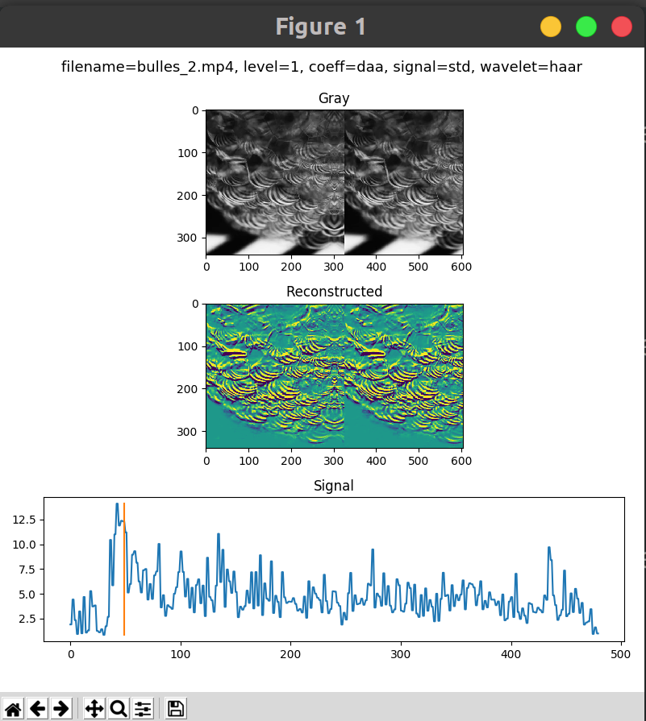

# Wavelets video analyser


## Installation

```
git clone https://github.com/theobdt/wavelets_analyser.git
cd wavelets_analyser
pip install -r requirements.txt
```
You need to have ffmpeg installed for this repo to work correctly.
```
sudo apt install ffmpeg
```

## Usage 
```
$ python wavelets.py -f <input_path> [-l <level>] [-c <coeff>] [-t <coeffs.txt>] [-w <wavelet>] [-s <signal>] [-p <peaks>] [-sf <wav_file>] [-o <output_path>]
```

### Options

* -i, --input : input video path
* -l, --level : decomposition level, must be >= 0
* -c, --coeff : one of the 8 coefficients to choose within the current decomposition level: ['aaa', 'daa'(default), 'ada', 'aad', 'dda', 'add', 'ddd']
    a : approximation
    d : details
    order : (time, y, x) 
* -t, --txt_file : path to txt file with multilevels coefficients. If 0 is indicated, will keep the last LF coeffs.
* -w, --wavelets : wavelet used (default='haar'), full list of wavelets available [here](https://pywavelets.readthedocs.io/en/latest/ref/wavelets.html)
* -s, --signal : operation used to compress 3D reconstructed frames to 1D array: 'std' (default) or 'mean'
* -p, --peaks : percentage of most important peaks to keep among all peaks detected in the signal. Must be a float between 0 and 1.
* -sf, --sound_file : if specified output signal as sound to this path. The signal is saved as an signed 8-bits PCM. Can be opened with Audacity for example.
* -o, --output : output path. If specified, the animation is not drawn but is saved to this path.

## Examples
To visualize the animation:
```
$ python wavelets.py -i input_video.mp4
$ python wavelets.py -i input_video.mp4 -l 2 -c ddd -s mean -w db2
$ python wavelets.py -i input_video.mp4 -t example_coeffs.txt -s mean -w db2 -p 0.1
```

To save the animation:
```
$ python wavelets.py -i input_video.mp4 -o output_animation.mp4
```
